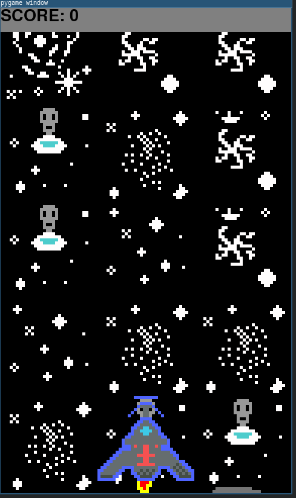

# Игра Space Arcade

Простенькая аркадная игра. Нужно уворачиваться кораблем от астеройдов. Создана как проект к курсу Twitch-канала [Максима Вершинина](https://www.twitch.tv/wozborn).

## Как играть

### Установите [Python 3.10+](https://www.python.org) если вы используете Windows.

### Установите git.

Для Windows скачайте и установите с [официального сайта](https://git-scm.com)

#### Для линукс

Откройте терминал и выполните следующие команды

Ubuntu/Debian:

`sudo apt update
sudo apt install git`

Fedora:

`sudo dnf install git`

CentOS/RHEL:

`sudo yum install git`

Arch Linux и производные:

`sudo pacman -S git`

### Клонируйте репозиторий

Введите в терминале:

`git clone https://github.com/AtheistATT/space`

### Зайдите в папку репозитория

В терминале введите:

`cd space`

### Подключение окружения:

Создайте окружение:

`python -m venv venv`

Активируйте окружение:

`venv\Scripts\activate` для Windows

`source venv/bin/activate` для Линукс

### Установите Pygame.

Введите:

`pip install pygame`

### Запустите игру.

Введите:

`python main.py`
